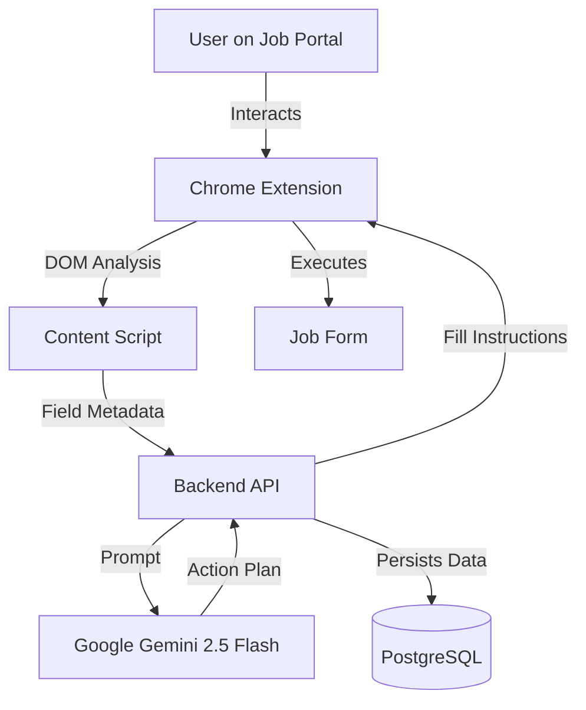

# Simplify for India - Project Documentation

## 1. Project Overview

**Simplify for India** is an intelligent job application assistant designed to streamline the process of applying to jobs on Indian job portals (Naukri, LinkedIn, Foundit, etc.) and company career pages (Greenhouse, Lever, Workday).

It consists of a **Chrome Extension** that detects job application forms and a **NestJS Backend** that powers the intelligent autofill logic using **Google Gemini AI**.

### Core Value Proposition
- **Automated Form Filling**: Instantly fills complex job applications.
- **Smart Field Mapping**: Uses AI to understand non-standard field names (e.g., "Current Fixed CTC" vs "Annual Compensation").
- **Application Tracking**: Automatically logs every application to a dashboard.
- **Indian Market Focus**: Specifically tuned for Indian hiring norms (CTC, Notice Period, etc.).
- **Bring Your Own Key (BYOK)**: Users can provide their own Gemini API key for higher rate limits and privacy.

---

## 2. System Architecture

The project is a **monorepo** managing two distinct applications:



### Directory Structure
```
simplify-for-india/
├── apps/
│   ├── backend/        # NestJS API Server
│   └── extension/      # React + Vite Chrome Extension
├── scripts/            # Setup scripts
├── package.json        # Root workspace config
└── ...
```

---

## 3. Backend (NestJS)

Located in `apps/backend`, this is the brain of the operation.

### Key Modules

#### A. LLM Module (`src/llm/`)
This module interfaces with Google's Generative AI.
- **Service**: `AgentService`
- **Model**: `gemini-2.5-flash`
- **Functionality**:
    1. Receives a list of form fields (ID, label, context) and the user's profile.
    2. Checks for a **user-provided API key** in the request headers (`x-gemini-api-key`). If present, it uses that key for the session.
    3. Constructs a prompt instructing the AI to act as an autofill agent.
    4. Returns a JSON action plan (`fill`, `select`, `check`, `skip`) for each field.
- **Smart Features**:
    - **EEOC Defaults**: Automatically handles sensitive demographic questions (Gender, Race, Veteran status) with "Prefer not to say" or smart defaults if data is missing.
    - **Fuzzy Matching**: Uses Levenshtein-like logic to match profile values to dropdown options (e.g., "Bangalore" -> "Bengaluru").
    - **Heuristic Fallback**: Contains regex-based logic if the LLM API is unavailable.

#### B. User Module (`src/users/`)
Manages user identity and the rich profile data model.
- **Entity**: `UserProfile` (`src/users/entities/user-profile.entity.ts`)
- **Schema Highlights**:
    - **Personal**: Name, Contact, Locations (Current/Preferred)
    - **Professional**: Experience, Education, Skills, Work History (JSONB)
    - **Indian Specifics**: `currentCtc`, `expectedCtc`, `noticePeriodDays`
    - **Compliance**: Visa status, Sponsorship needs

#### C. Applications Module (`src/applications/`)
Tracks job applications.
- **Entity**: `Application`
- **Data**: Stores Company Name, Job URL, Date Applied, and Status.

#### D. Auth Module (`src/auth/`)
Standard JWT-based authentication using Passport strategy.

---

## 4. Chrome Extension (React + Vite)

Located in `apps/extension`, built with Manifest V3.

### Core Components

#### A. Content Script ("Super Scraper" Engine)
The workhorse that interacts with the web page (`src/content.ts`, `src/utils/fieldMapper.ts`).
- **Deep DOM Analysis**:
    - **Shadow DOM**: Recursively pierces `shadowRoot` to find fields in modern Web Components.
    - **iFrames**: Runs in `all_frames` to detect embedded forms (common in enterprise ATS).
    - **Accessibility Tree**: Uses advanced logic (`getComputedLabel`) to find labels via `aria-label`, `aria-labelledby`, placeholder, and nearby text nodes.
- **Form Detection**:
    - Scans DOM for `<form>` tags and "Virtual Forms" (SPA containers).
    - **Scoring Algorithm**: specific keywords ("Resume", "CTC", "Notice Period") boost a form's score.
- **Interaction**:
    - Injects a floating **"Autofill with Simplify"** button.
    - **Execution**:
        - **React Support**: Uses native value setters to bypass React/Angular controlled input restrictions.
        - **Combobox Handling**: Simulates full keyboard sequences (type -> wait -> Enter) to trigger dropdown searches.
        - **Event Simulation**: Dispatches comprehensive event chains (`focus`, `click`, `input`, `change`, `blur`) to ensure validity.

#### B. UI/UX (`src/components/`)
A completely refreshed React interface:
- **Dashboard**: Gradient header, modern card layout, and tabbed navigation.
- **Settings**: New tab to securely save your personal **Gemini API Key**.
- **Profile**: Clean, collapsible sections for demographics and advanced options.

---

## 5. AI Agent Logic

The `AgentService` uses a sophisticated prompt structure:

1.  **Context**: "You are an intelligent job application autofill agent..."
2.  **Profile Summary**: A condensed, text-based representation of the `UserProfile`.
3.  **Field Definitions**: A list of fields from the page with their metadata.
4.  **Instructions**:
    - "For dropdowns, choose the BEST matching option value."
    - "For split address fields, split the address appropriately."
    - "For notice period 'Immediate', match to 0 days."
    - "Confidence Scoring: 1.0 (Perfect) to 0.0 (Skip)."

**Example Prompt Output:**
```json
[
  {
    "field_id": "field_12",
    "action": "select",
    "value": "30",
    "confidence": 0.9,
    "reasoning": "Selected '30 days' based on user's 1 month notice period"
  }
]
```

---

## 6. Data Model: UserProfile

The `user_profiles` table is extensive to cover diverse application forms:

| Category | Fields |
|----------|--------|
| **Identity** | `firstName`, `lastName`, `fullName`, `email`, `phone` |
| **Location** | `currentLocation`, `preferredLocation`, `address` |
| **Career** | `currentCompany`, `jobTitle`, `totalExperienceYears` |
| **Compensation** | `currentCtc`, `expectedCtc`, `desiredSalary` (Text fields to handle currency formats) |
| **Logistics** | `noticePeriodDays`, `availabilityDate` |
| **URLs** | `linkedinUrl`, `githubUrl`, `portfolioUrl` |
| **Documents** | `coverLetter`, `workHistory` (Text summary) |
| **Legal/EEOC** | `gender`, `race`, `veteranStatus`, `disabilityStatus`, `workAuthorization`, `requiresSponsorship` |

---

## 7. Setup & Development

### Prerequisites
- Node.js v16+
- PostgreSQL
- Docker (optional, for easy DB setup)

### Installation
1.  **Clone**: `git clone <repo>`
2.  **Install**: `npm install`
3.  **Database**:
    - Run `docker run --name simplify-postgres -e POSTGRES_PASSWORD=postgres -p 5432:5432 -d postgres`
    - Create DB: `docker exec -it simplify-postgres psql -U postgres -c "CREATE DATABASE simplify_india;"`
4.  **Env**: Configure `apps/backend/.env`.
5.  **Build**: `npm run build`

### Running
- **Backend**: `npm run start:dev -w apps/backend` (Port 3000)
- **Extension**: `npm run dev -w apps/extension` (Vite Dev Server) -> Load `dist` folder in Chrome.

### Using "Bring Your Own Key" (BYOK)
1.  Get a free API key from [Google AI Studio](https://aistudio.google.com/).
2.  Open the extension popup.
3.  Go to the **Settings** tab.
4.  Paste your key and click **Save**.
5.  All future autofill requests will use your key, bypassing shared rate limits.

### Debugging
The extension exposes a global debug object in the browser console:
- `window.__simplifyDebug.detectForms()`: Force re-scan of the page.
- `window.__simplifyDebug.scoreAllForms()`: See why a form was/wasn't detected.
- `window.__simplifyDebug.findVirtualForms()`: List detected "virtual" form containers.