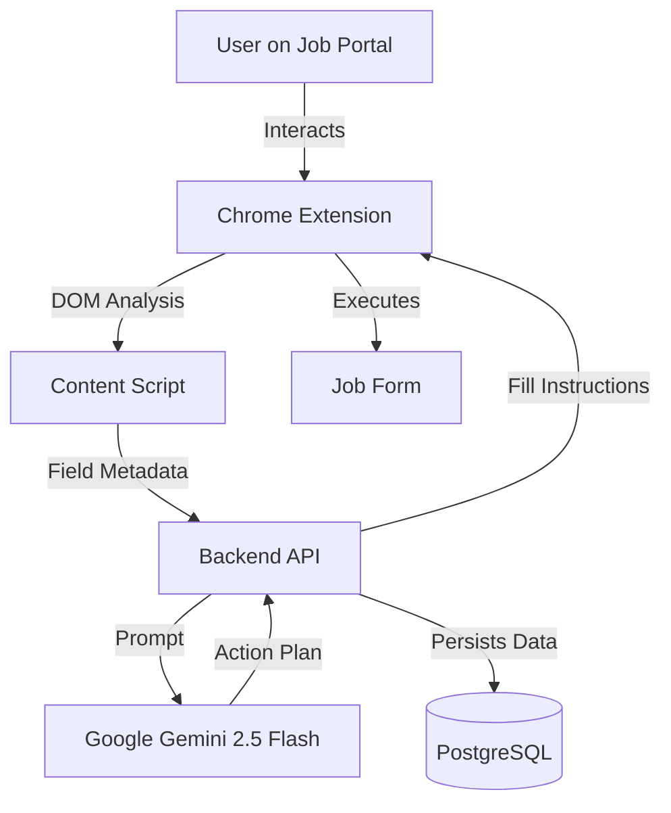

# Simplify for India - Project Documentation

## 1. Project Overview

**Simplify for India** is an intelligent job application assistant designed to streamline the process of applying to jobs on Indian job portals (Naukri, LinkedIn, Foundit, etc.) and company career pages (Greenhouse, Lever, Workday).

It consists of a **Chrome Extension** that detects job application forms and a **NestJS Backend** that powers the intelligent autofill logic using **Google Gemini AI**.

### Core Value Proposition
- **Automated Form Filling**: Instantly fills complex job applications.
- **Smart Field Mapping**: Uses AI to understand non-standard field names (e.g., "Current Fixed CTC" vs "Annual Compensation").
- **Application Tracking**: Automatically logs every application to a dashboard.
- **Indian Market Focus**: Specifically tuned for Indian hiring norms (CTC, Notice Period, etc.).

---

## 2. System Architecture

The project is a **monorepo** managing two distinct applications:



### Directory Structure
```
simplify-for-india/
├── apps/
│   ├── backend/        # NestJS API Server
│   └── extension/      # React + Vite Chrome Extension
├── scripts/            # Setup scripts
├── package.json        # Root workspace config
└── ...
```

---

## 3. Backend (NestJS)

Located in `apps/backend`, this is the brain of the operation.

### Key Modules

#### A. LLM Module (`src/llm/`)
This module interfaces with Google's Generative AI.
- **Service**: `AgentService`
- **Model**: `gemini-2.5-flash`
- **Functionality**:
    1. Receives a list of form fields (ID, label, context) and the user's profile.
    2. Constructs a prompt instructing the AI to act as an autofill agent.
    3. Returns a JSON action plan (`fill`, `select`, `check`, `skip`) for each field.
- **Smart Features**:
    - **EEOC Defaults**: Automatically handles sensitive demographic questions (Gender, Race, Veteran status) with "Prefer not to say" or smart defaults if data is missing.
    - **Fuzzy Matching**: Uses Levenshtein-like logic to match profile values to dropdown options (e.g., "Bangalore" -> "Bengaluru").
    - **Heuristic Fallback**: Contains regex-based logic if the LLM API is unavailable.

#### B. User Module (`src/users/`)
Manages user identity and the rich profile data model.
- **Entity**: `UserProfile` (`src/users/entities/user-profile.entity.ts`)
- **Schema Highlights**:
    - **Personal**: Name, Contact, Locations (Current/Preferred)
    - **Professional**: Experience, Education, Skills, Work History (JSONB)
    - **Indian Specifics**: `currentCtc`, `expectedCtc`, `noticePeriodDays`
    - **Compliance**: Visa status, Sponsorship needs

#### C. Applications Module (`src/applications/`)
Tracks job applications.
- **Entity**: `Application`
- **Data**: Stores Company Name, Job URL, Date Applied, and Status.

#### D. Auth Module (`src/auth/`)
Standard JWT-based authentication using Passport strategy.

---

## 4. Chrome Extension (React + Vite)

Located in `apps/extension`, built with Manifest V3.

### Core Components

#### A. Content Script (`src/content.ts`)
The workhorse that interacts with the web page.
- **Form Detection**:
    - Scans DOM for `<form>` tags.
    - Also detects "Virtual Forms" (`<div>` containers used in SPAs like React/Angular apps).
    - **Scoring Algorithm**: specific keywords ("Resume", "CTC", "Notice Period") boost a form's score to identify the *real* job application form amidst search bars and login forms.
- **Interaction**:
    - Injects a floating **"Autofill with Simplify"** button.
    - Scrapes comprehensive metadata: Labels, Placeholders, Aria-labels, Surrounding text.
    - **Execution**: Receives the "Action Plan" from the backend and triggers native DOM events (`input`, `change`, `blur`) and React synthetic events to ensure data binding works.

#### B. Popup UI (`src/popup.tsx`)
A clean React interface for:
- Logging in.
- Viewing the "Applications" dashboard.
- Quick profile edits.

#### C. Field Mapper (`src/utils/fieldMapper.ts`)
Client-side heuristics for detecting field types. Used for:
- Preliminary analysis.
- Fallback if the backend is unreachable.
- Generating page signatures for caching.

---

## 5. AI Agent Logic

The `AgentService` uses a sophisticated prompt structure:

1.  **Context**: "You are an intelligent job application autofill agent..."
2.  **Profile Summary**: A condensed, text-based representation of the `UserProfile`.
3.  **Field Definitions**: A list of fields from the page with their metadata.
4.  **Instructions**:
    - "For dropdowns, choose the BEST matching option value."
    - "For split address fields, split the address appropriately."
    - "For notice period 'Immediate', match to 0 days."
    - "Confidence Scoring: 1.0 (Perfect) to 0.0 (Skip)."

**Example Prompt Output:**
```json
[
  {
    "field_id": "field_12",
    "action": "select",
    "value": "30",
    "confidence": 0.9,
    "reasoning": "Selected '30 days' based on user's 1 month notice period"
  }
]
```

---

## 6. Data Model: UserProfile

The `user_profiles` table is extensive to cover diverse application forms:

| Category | Fields |
|----------|--------|
| **Identity** | `firstName`, `lastName`, `fullName`, `email`, `phone` |
| **Location** | `currentLocation`, `preferredLocation`, `address` |
| **Career** | `currentCompany`, `jobTitle`, `totalExperienceYears` |
| **Compensation** | `currentCtc`, `expectedCtc`, `desiredSalary` (Text fields to handle currency formats) |
| **Logistics** | `noticePeriodDays`, `availabilityDate` |
| **URLs** | `linkedinUrl`, `githubUrl`, `portfolioUrl` |
| **Documents** | `coverLetter`, `workHistory` (Text summary) |
| **Legal/EEOC** | `gender`, `race`, `veteranStatus`, `disabilityStatus`, `workAuthorization`, `requiresSponsorship` |

---

## 7. Setup & Development

### Prerequisites
- Node.js v16+
- PostgreSQL
- Google Gemini API Key

### Installation
1.  **Clone**: `git clone <repo>`
2.  **Install**: `npm install`
3.  **Database**: Create Postgres DB `simplify_india`.
4.  **Env**: Configure `apps/backend/.env` (DB URL, JWT Secret, Gemini Key).
5.  **Build**: `npm run build`

### Running
- **Backend**: `npm run start:dev -w apps/backend` (Port 3000)
- **Extension**: `npm run dev -w apps/extension` (Vite Dev Server) -> Load `dist` folder in Chrome.

### Debugging
The extension exposes a global debug object in the browser console:
- `window.__simplifyDebug.detectForms()`: Force re-scan of the page.
- `window.__simplifyDebug.scoreAllForms()`: See why a form was/wasn't detected.
